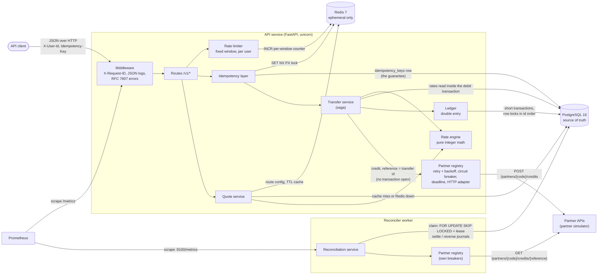
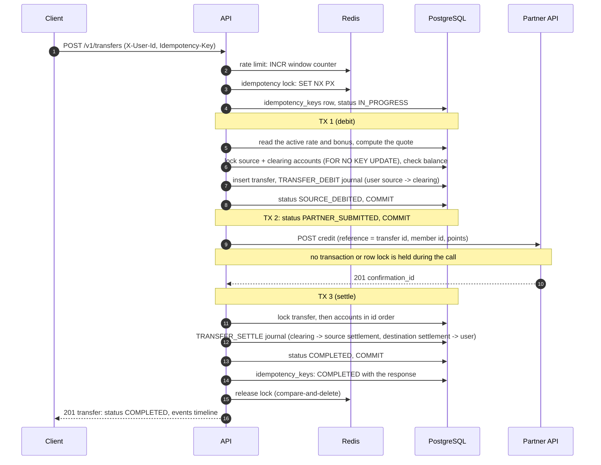
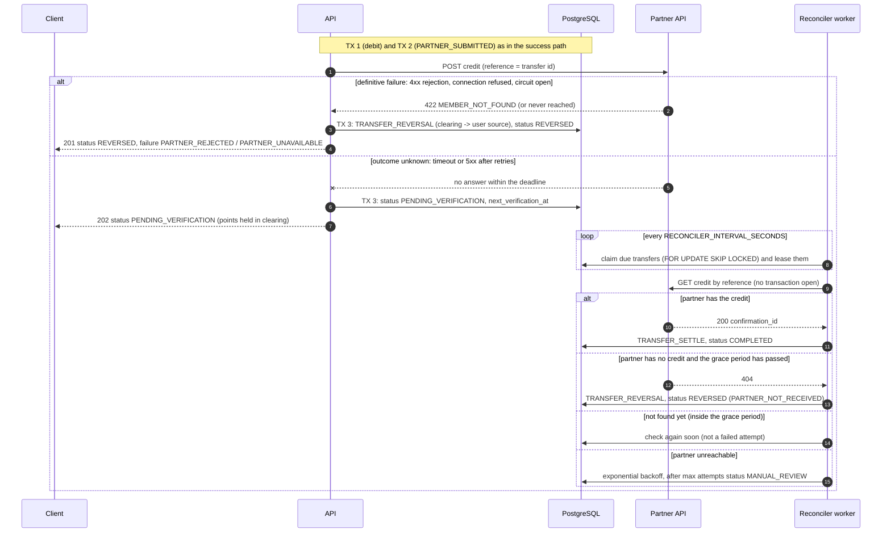
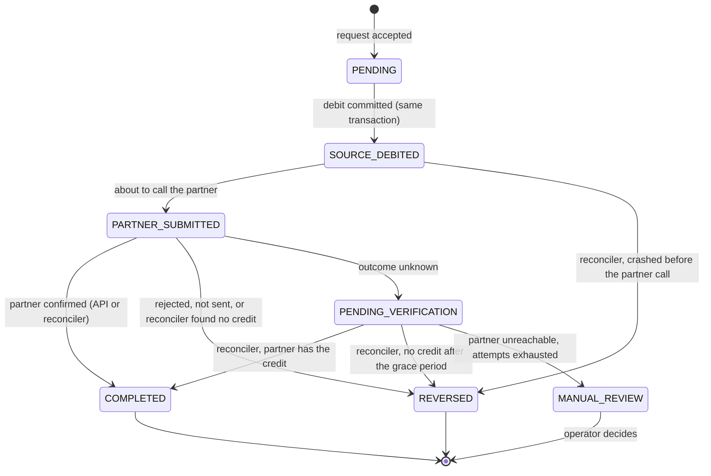
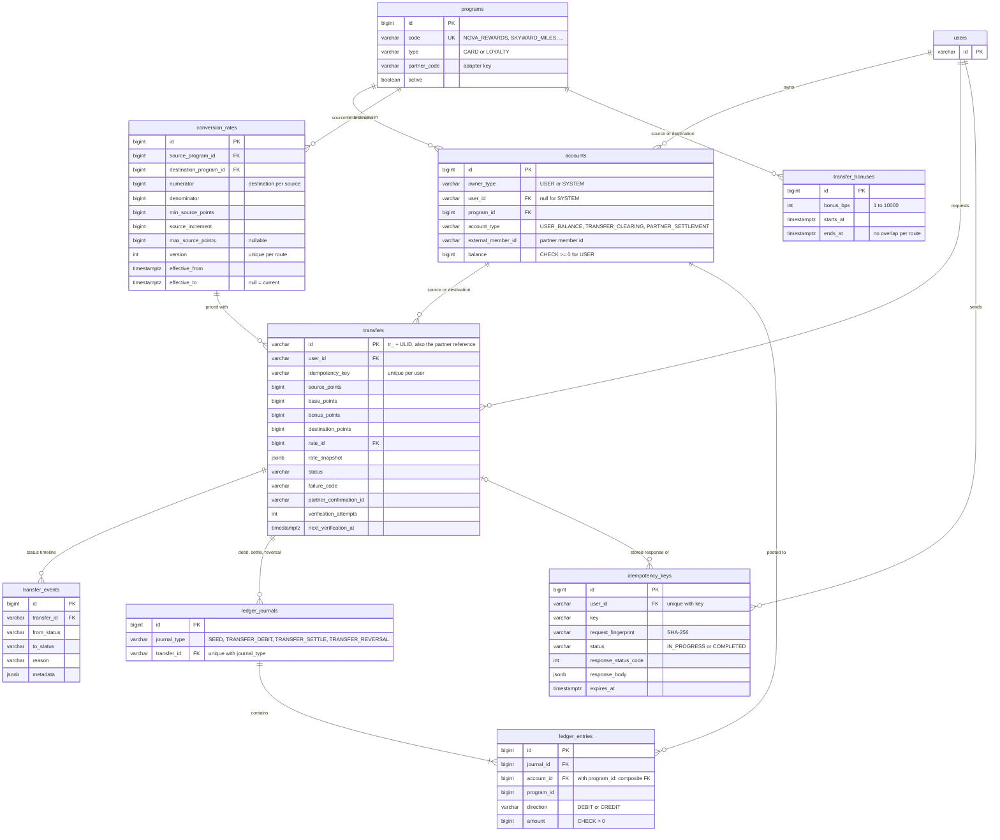

# Architecture

The Loyalty Points Transfer Engine moves points between credit-card reward programs and
travel loyalty programs, in both directions. Points behave like money, so the design is
driven by one question: *what happens when something goes wrong?*

Contents: [components](#1-components) ·
[successful transfer](#2-a-successful-transfer) ·
[failure paths](#3-failure-paths-and-reconciliation) ·
[state machine](#4-transfer-state-machine) · [database](#5-database) ·
[ledger example](#6-the-ledger-in-practice) · [decisions](#7-decisions)

Every diagram's source is in `docs/diagrams/*.mmd` (a unit test keeps this page in sync
with them). `make diagrams` exports SVG and PNG versions to `docs/images/`.

## 1. Components

<!-- diagram: component -->

Image: [docs/images/component.svg](images/component.svg)

Two processes share one codebase and one Docker image: the **API**, which runs transfers
synchronously with a bounded partner deadline, and the **reconciler worker**, which
resolves anything the API could not finish. **PostgreSQL is the only source of truth**:
balances, transfers, the audit trail and idempotency records all live there, protected
by constraints and triggers. **Redis holds only data that is safe to lose** (idempotency
locks, a rate cache, rate-limit counters); every Redis failure is handled by falling back
to PostgreSQL or failing open. Partners are reached only through the adapter interface
in `app/partners/base.py`, so the saga never sees HTTP, and in development they are a
separate simulator service reached over real HTTP, so timeouts and errors are real.

| Module | Responsibility |
| --- | --- |
| `app/services/rate_engine.py` | pure conversion math, quote service |
| `app/services/rate_repository.py`, `app/cache/rate_cache.py` | active rate and bonus lookup, Redis cache |
| `app/services/rate_admin.py` | versioned rates, bonuses |
| `app/services/ledger.py` | double-entry journals, row locking |
| `app/services/idempotency.py`, `app/api/idempotency.py` | idempotency keys |
| `app/services/transfer_service.py` | the transfer saga |
| `app/domain/transfer_state.py` | state machine and audit events |
| `app/partners/` | adapter interface, HTTP adapter, retries, circuit breaker, registry |
| `app/services/reconciliation.py`, `app/workers/reconciler.py` | reconciliation |

## 2. A successful transfer

<!-- diagram: transfer-success -->

Image: [docs/images/transfer-success.svg](images/transfer-success.svg)

A transfer is three short local transactions around one partner call. **TX 1** prices the
transfer from PostgreSQL (never from the cache), locks the source and clearing accounts,
checks the balance and moves the points into the source program's clearing account; if
anything fails here nothing is written. **TX 2** records that the partner is about to be
called, so that after a crash the reconciler knows the partner may have been contacted.
The partner call itself runs with **no transaction or lock held**: it can take seconds,
and holding locks would block every other transfer on those accounts. The transfer id is
the partner reference, so any retry of the call is idempotent at the partner. **TX 3**
settles: the source points leave clearing and the destination points reach the user.

## 3. Failure paths and reconciliation

<!-- diagram: transfer-failure -->

Image: [docs/images/transfer-failure.svg](images/transfer-failure.svg)

"Automatic rollback" means **compensation**: the debit is already committed, so a failure
is undone by a reversal journal that returns the points, never by deleting history. The
key distinction is between a **definitive** failure (the partner said no, or the request
provably never left) and an **unknown** outcome (a timeout or 5xx after the request was
sent). An unknown outcome is never guessed: the partner may have applied the credit, and
reversing would pay the user twice. The points wait in clearing and the reconciler asks
the partner by reference. "Not found" is trusted only after a grace period longer than
the longest possible in-flight request; if the partner cannot be reached at all, the
transfer goes to `MANUAL_REVIEW` for an operator instead of being guessed. The reconciler
also recovers transfers left behind by a crash at any point (see
[failure-scenarios.md](failure-scenarios.md)).

## 4. Transfer state machine

<!-- diagram: transfer-states -->

Image: [docs/images/transfer-states.svg](images/transfer-states.svg)

The allowed transitions are a table in `app/domain/transfer_state.py`; any other move
raises `InvalidStateTransitionError`, and a unit test checks every possible pair of
statuses against an independent copy of the brief's transition list. Every transition writes an append-only `transfer_events` row in the
same transaction as the status change, which is the timeline returned by
`GET /v1/transfers/{id}`. `COMPLETED` and `REVERSED` are final (the ledger is settled);
`MANUAL_REVIEW` is terminal for automation. `POST /v1/transfers` returns `201` for a final
state and `202` for anything still being resolved, and the `status` field says which.

## 5. Database

<!-- diagram: database -->

Image: [docs/images/database.svg](images/database.svg)

All points are `BIGINT` and all rates are integer numerator/denominator pairs; there is no
floating point anywhere in the money path. The schema enforces the important rules itself,
so a bug in application code cannot break them: user balances cannot go negative (CHECK);
a ledger entry's program must match its account's program (composite foreign key);
journals, entries and transfer events are append-only (triggers); every journal balances
per program at commit (deferred constraint trigger); a transfer has at most one journal of
each type, so it can never be debited, settled or reversed twice (unique constraint); a
route has one open rate version and no overlapping bonuses (partial unique index,
exclusion constraint). Rates are versioned, never updated in place, and each transfer keeps
a JSON snapshot of the terms it was priced with.

## 6. The ledger in practice

Every account follows one sign convention: `balance = credits - debits`. Each program has
two system accounts: `TRANSFER_CLEARING` holds points that are in flight, and
`PARTNER_SETTLEMENT` is the platform's position with the partner that runs the program
(it mirrors, with a negative sign, all points that entered users' accounts from that
partner). A journal balances **within each program**: points of different programs are
different units and are never netted.

**A completed transfer**: Alice moves 10,000 NOVA_REWARDS to SKYWARD_MILES at 1:1 with the
+25% bonus, so the partner credits 12,500 miles. Balances are those right after seeding.

| Journal | Account | Program | Debit | Credit |
| --- | --- | --- | ---: | ---: |
| TRANSFER_DEBIT | alice NOVA (user) | NOVA | 10,000 | |
| | NOVA clearing | NOVA | | 10,000 |
| TRANSFER_SETTLE | NOVA clearing | NOVA | 10,000 | |
| | NOVA settlement | NOVA | | 10,000 |
| | SKYWARD settlement | SKYWARD | 12,500 | |
| | alice SKYWARD (user) | SKYWARD | | 12,500 |

| Account | Before | After debit | After settle |
| --- | ---: | ---: | ---: |
| alice NOVA | 250,000 | 240,000 | 240,000 |
| NOVA clearing | 0 | 10,000 | 0 |
| NOVA settlement | -300,000 | -300,000 | -290,000 |
| SKYWARD settlement | -195,000 | -195,000 | -207,500 |
| alice SKYWARD | 45,000 | 45,000 | 57,500 |

Each program still sums to zero at every step: NOVA is 240,000 (Alice) + 50,000 (Bob)
+ 0 − 290,000 = 0; SKYWARD is 57,500 + 150,000 − 207,500 = 0.

**A reversed transfer**: the partner rejects the credit. The debit is compensated in full.

| Journal | Account | Program | Debit | Credit |
| --- | --- | --- | ---: | ---: |
| TRANSFER_DEBIT | alice NOVA (user) | NOVA | 10,000 | |
| | NOVA clearing | NOVA | | 10,000 |
| TRANSFER_REVERSAL | NOVA clearing | NOVA | 10,000 | |
| | alice NOVA (user) | NOVA | | 10,000 |

| Account | Before | After debit | After reversal |
| --- | ---: | ---: | ---: |
| alice NOVA | 250,000 | 240,000 | 250,000 |
| NOVA clearing | 0 | 10,000 | 0 |

Nothing is deleted: both journals stay in the ledger as the record of what happened.
While a transfer is `PENDING_VERIFICATION`, its points sit in clearing (the "after debit"
column) until the reconciler settles or reverses it. `make check-invariants` verifies all
of this on the live database (see [ledger-invariants.md](ledger-invariants.md)).

## 7. Decisions

Architecture Decision Records in [docs/adr/](adr/):

| ADR | Decision |
| --- | --- |
| [0001](adr/0001-saga-with-compensation.md) | Saga with compensation instead of distributed transactions (2PC) |
| [0002](adr/0002-double-entry-ledger.md) | Double-entry ledger for balances |
| [0003](adr/0003-idempotency-redis-lock-and-postgres-record.md) | Idempotency with a Redis lock and a PostgreSQL durable record |
| [0004](adr/0004-integer-rates-versioning-and-snapshots.md) | Integer ratio conversion with rate versioning and snapshots |
| [0005](adr/0005-synchronous-api-with-async-reconciliation.md) | Synchronous API with asynchronous reconciliation for unknown outcomes |
| [0006](adr/0006-postgres-source-of-truth-redis-ephemeral.md) | PostgreSQL as the source of truth; Redis only for ephemeral concerns |
| [0007](adr/0007-http-status-for-transfer-outcomes.md) | HTTP status semantics for transfer outcomes (201 / 202) |

Every failure scenario, the system's behaviour, the final state and the test that proves
it: [failure-scenarios.md](failure-scenarios.md).
